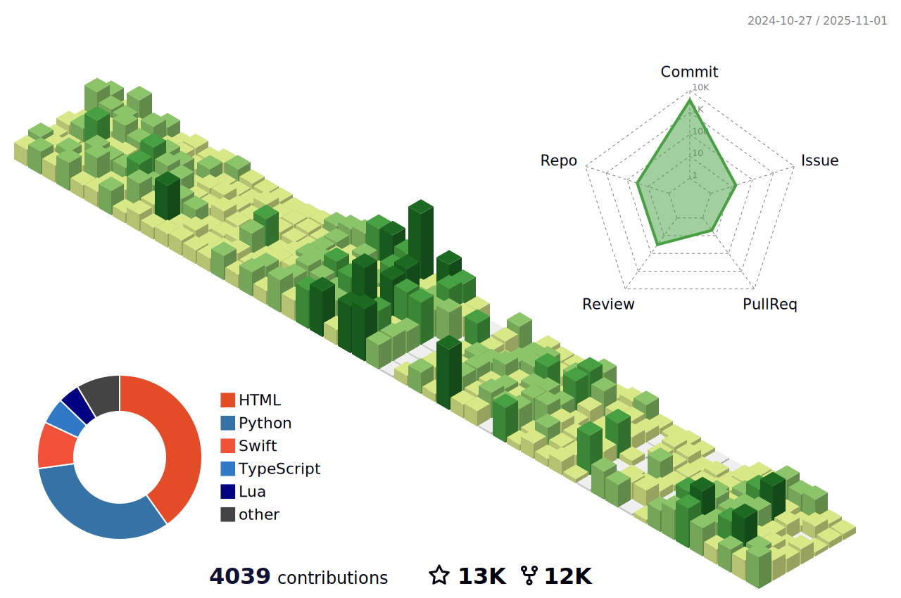

# 📚 About Me

**Continuous Learner | Tech Blogger | Open Source Enthusiast**  

🔗 **Connect through my technical blogs**:  
- **CSDN Blog**: <https://xiaoshen.blog.csdn.net/>  
- **掘金 Blog**: <https://juejin.cn/user/70007368988926/>  

🌟 **My Learning Philosophy**:  
> *"When you encounter obstacles in your coding journey, learn relentlessly. Knowledge compounds – it's the ultimate investment that never depreciates."*

---

## 🐍 Python 

### Recommended Package Mirrors (China):
- **Tsinghua University**: `https://pypi.tuna.tsinghua.edu.cn/simple/`  
- **Douban**: `http://pypi.doubanio.com/simple/`  
- **Aliyun**: `http://mirrors.aliyun.com/pypi/simple/`  
- **USTC**: `https://pypi.mirrors.ustc.edu.cn/simple/`  
- **NetEase**: `http://mirrors.163.com/pypi/simple/`  

**Installation Example**:
```bash
pip install -r requirements.txt -i https://pypi.tuna.tsinghua.edu.cn/simple/
```

## 📦 Node

### Trusted npm Registries:
- **Official Registry**: `http://www.npmjs.org`  
- **Aliyun Mirror**: `https://registry.npmmirror.com`  

**CLI Operations**:  
Check current registry:
```bash
npm config get registry
```

Switch registries:
```bash
# For official
npm config set registry https://www.npmjs.org

# For Aliyun mirror
npm config set registry https://registry.npmmirror.com
```


